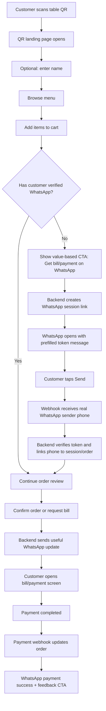
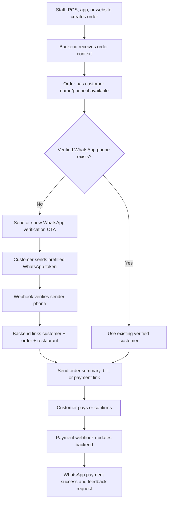

# Palate WhatsApp Phase 1 Flow Explanation

This document explains the customer flow Palate should show in the app, web, QR, POS, and captain-assisted journeys.

The main goal is simple:

```text
Let the customer start with low friction.
Collect name when possible.
Verify the phone number through WhatsApp before order commitment, bill, or payment.
Use WhatsApp for continuity and app/web pages for rich screens.
```

## Core Product Logic

Palate does not need to force verification on the first screen.

The customer can browse, build a cart, or interact with staff first. Verification can be triggered later when there is real value:

- get order updates on WhatsApp
- save or confirm cart
- receive bill on WhatsApp
- receive payment link
- continue payment
- receive feedback link

The verified identity is the WhatsApp sender phone number received from the webhook.

The typed name is useful, but it is not the verified identity. If the user does not type a name, Palate can use the WhatsApp profile name as a fallback display name.

## System Roles

```text
Palate app/web/POS/captain screen
Shows UI, collects optional name/phone, builds cart/order, opens links.

Palate WhatsApp backend
Creates verification sessions, stores order context, verifies WhatsApp sender phone, sends messages, maps payment events.

WhatsApp
Low-friction phone verification and customer communication channel.

Payment provider
Confirms payment for an already-known order. It is not the source of verified phone identity.
```

## What Each Screen Should Do

| Screen | What customer sees | What backend receives | Verification rule |
|---|---|---|---|
| QR landing | Restaurant landing page, optional name input, menu CTA | restaurant_id, restaurant_name, optional name | Optional |
| Menu | Browse items, add to cart | menu_url, restaurant context | Optional soft CTA |
| Cart | Cart items, total, continue CTA | cart/order draft, optional name/phone | Recommended |
| Order review | Items, taxes, total, confirm order | order_id, order_url, bill_url | Strongly recommended or required |
| Payment | Amount due, payment CTA | payment_url, order_id | Required before payment link or payment continuation |
| Bill | Bill details, amount due | bill_url, payment_url | Required |
| Feedback | Rating/review form | feedback_url, order_id | Can happen after payment |
| Captain/POS | Staff creates order and sends link/bill | external_order_id, restaurant, amount, links | Required before customer bill/payment on WhatsApp |

## QSR Self-Serve Flow

QSR is more complex because the customer may start alone from a QR code, browse first, and only later commit.



### QSR Screen-by-Screen

1. QR landing
   Customer scans QR and lands on the restaurant page.
   Show optional name input, not a hard phone wall.

2. Menu
   Customer browses normally.
   Show a soft CTA like `Get order updates on WhatsApp`.

3. Cart
   Customer has intent now.
   Ask for WhatsApp verification with a value-based CTA:

```text
Get bill and payment link on WhatsApp
```

4. WhatsApp verification
   Backend creates a token like `PALATE_XXXX`.
   Customer sends the prefilled WhatsApp message.
   Backend verifies the real sender phone.

5. Order review
   Customer comes back to cart/order review using the `resume_url`.
   The app now knows the customer is verified.

6. Bill/payment
   WhatsApp sends a useful bill summary and one payment link.
   The full payment UI stays in the app/web page.

7. Feedback
   After payment, WhatsApp can send feedback or dish-rating CTA.

## Non-QSR / Reservation / Slower-Service Flow

This flow is less complex because staff, captain, POS, or the app may create the order before the customer needs to act.



### Non-QSR Screen-by-Screen

1. Staff/POS/app creates order
   Order can be created before customer verification.

2. Backend stores order context
   The order should include:

```text
external_order_id
restaurant_id
restaurant_name
customer_name if available
menu_url
order_url
bill_url
payment_url
feedback_url
amounts
line_items
```

3. Verification check
   If the customer already has verified WhatsApp phone, continue.
   If not, trigger WhatsApp verification before bill/payment.

4. Bill/payment communication
   WhatsApp sends concise useful information.
   Full bill/payment screens live in the app/web.

5. Payment success
   Payment provider confirms money.
   Backend sends payment success and feedback CTA.

## Capture And Verification Rules

### What Can Be Captured Early

- name
- optional phone entered by customer
- optional email
- restaurant context
- cart/order context

These fields are useful but not all are verified.

### What Is Verified

The verified phone is captured from WhatsApp webhook sender number:

```text
Customer sends WhatsApp token message
-> webhook receives sender phone
-> backend validates token
-> backend links sender phone to session/order/customer
```

### If User Skips Name

Use this order:

```text
typed name
-> WhatsApp profile name fallback
-> generic guest label
```

The phone number remains the real identity key.

## Recommended Verification Timing

Use this priority:

| Moment | Recommendation |
|---|---|
| Landing | Optional |
| Menu | Optional soft CTA |
| Cart | Recommended |
| Order review | Strong prompt |
| Bill | Required |
| Payment | Required |
| Captain/POS bill send | Required |

Best default:

```text
Do not block menu browsing.
Do not block cart building.
Require verification before bill/payment/order commitment.
```

## Message Strategy

WhatsApp should not dump every link.

Each message should have one purpose:

| Message | What it should contain | Link behavior |
|---|---|---|
| Verification success | name, verified phone, linked order, next step | one continue link |
| Order summary | items, total, order status | one view order link |
| Bill | items, subtotal, tax, total, amount due | one pay link |
| Payment reminder | amount due, order reference | one pay link |
| Payment success | paid amount, order reference | optional feedback link |
| Feedback request | short thank-you, review prompt | one feedback link |
| Dish rating | dish name and review CTA | one rating/review link |

## Real Integration Pattern

The client app or backend calls the Palate WhatsApp backend.

### 1. Create order context

```text
POST /api/v1/captain/orders
```

Send order data and real app/web URLs.

### 2. Start verification from any screen

```text
POST /api/v1/whatsapp/session-link
```

Send:

```text
order_id or restaurant_id
customer_name if available
provided_phone if available
entry_point = menu | cart | order | payment | captain
intent = verify_before_payment | link_order | send_bill
resume_url = the page where customer should return
```

### 3. Poll verification status

```text
GET /api/v1/whatsapp/sessions/{session_id}
```

Frontend waits for:

```text
session_status = verified
next_action = resume_flow
```

Then it continues the customer to the right screen.

## Client Explanation

Use this wording with the client:

```text
The system does not force every customer to verify at the first screen.

Customers can browse and build intent first. When they reach cart, order review, bill, or payment, Palate prompts them to continue on WhatsApp.

When the customer sends the prefilled WhatsApp message, the backend verifies the real WhatsApp sender number and links it to the current order/session.

After that, Palate can send useful order, bill, payment, and feedback updates to the verified WhatsApp number.

The app/web screens still handle menu, cart, bill, payment, and feedback UI. WhatsApp handles identity, continuity, and high-intent reminders.
```

## Final Recommended Flow

```text
QSR:
QR -> menu -> cart -> WhatsApp verification -> order review -> bill/payment -> payment success -> feedback

Non-QSR:
staff/POS/app creates order -> WhatsApp verification if needed -> bill/payment message -> payment success -> feedback
```

The same backend supports both flows because the verification session can start from any screen.
