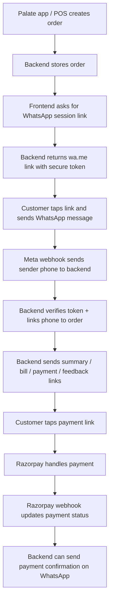
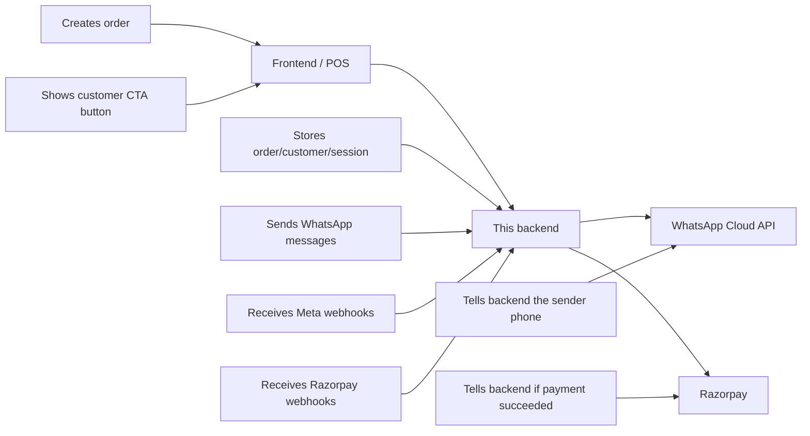

# Palate WhatsApp Phase 1 Visual Demo Flow

This file is the simple version.

If you feel overloaded, read only these 3 lines first:

```text
WhatsApp proves who the customer is.
Razorpay proves whether payment happened.
This backend connects the order, the customer phone, and the payment state.
```

## One-Screen Summary



## What This Backend Is

Think of it as the control room.

- It does not render customer screens.
- It does not render a menu page.
- It does not render a bill page.
- It does not build a mobile app.
- It does store the order.
- It does verify the customer’s WhatsApp phone.
- It does send the correct links to the customer.
- It does update payment state after Razorpay webhook confirmation.

## The Real-Life Customer Journey

### Step 1: Order exists

The restaurant or Palate POS creates an order.

Example:

```text
Order ID: ord_123
Restaurant: Palate Indiranagar
Customer: Ananya
Amount: INR 1,240
Bill URL: https://palate.app/bill/ord_123
Payment URL: https://pay.palate.app/pay/ord_123
Feedback URL: https://palate.app/feedback/ord_123
Menu URL: https://palate.app/menu/indiranagar
```

At this point the backend knows:

```text
There is an order.
There may be a customer record.
But the customer's WhatsApp identity is not verified yet.
```

### Step 2: Customer taps a WhatsApp CTA

The frontend shows something like:

```text
Get your bill on WhatsApp
```

or:

```text
Continue on WhatsApp
```

Frontend calls:

```text
POST /api/v1/whatsapp/session-link
```

The backend creates:

- a token like `PALATE_8F3K92QX`
- a DB record in `whatsapp_sessions`
- a `wa.me` link

Example returned link:

```text
https://wa.me/919999999999?text=Hi%20Palate%20Indiranagar,%20I%20want%20to%20link%20my%20order%20ord_123.%20Token:%20PALATE_8F3K92QX
```

### Step 3: Customer sees WhatsApp open

Customer experience:

1. taps button
2. WhatsApp opens
3. message is already filled in
4. customer presses send

What customer sees in WhatsApp:

```text
Hi Palate Indiranagar, I want to link my order ord_123. Token: PALATE_8F3K92QX
```

### Step 4: Backend verifies identity

Meta sends a webhook to the backend.

The backend receives:

- the real WhatsApp sender number
- the message content
- the token

Then it does:

```text
Find matching token hash
Check token is not expired
Mark session as verified
Link:
  WhatsApp phone -> customer -> order -> restaurant
```

This is the identity moment.

This is the point where Palate can safely say:

```text
This WhatsApp number belongs to the person who linked this order.
```

## What The Customer Gets Back

After verification, the backend can send useful operational messages.

Example message:

```text
Palate Indiranagar: your order ord_123 is linked on WhatsApp.
Items: 2 x Chicken Bowl, 1 x Lemon Soda
Total: INR 1240.00
Bill: https://palate.app/bill/ord_123
Payment: https://pay.palate.app/pay/ord_123
Feedback: https://palate.app/feedback/ord_123
```

That means the customer can now tap links directly from WhatsApp.

## Where Menu Links / App Links / Web Links Fit

The backend can send any URL you choose.

### Option A: Web links

Example:

```text
https://palate.app/menu/indiranagar
https://palate.app/order/ord_123
https://palate.app/bill/ord_123
https://palate.app/feedback/ord_123
```

When tapped:

- browser opens
- customer lands on Palate web page

### Option B: App deep links

Example:

```text
palate://menu/indiranagar
palate://order/ord_123
palate://bill/ord_123
palate://feedback/ord_123
```

When tapped:

- Palate mobile app opens
- app goes directly to the relevant screen

Important:

```text
This backend can send these links.
But the actual app/web page must already exist on the frontend/mobile side.
```

## Super Simple Visual Split



## What WhatsApp Does vs What Razorpay Does

### WhatsApp does this

```text
customer sends first message
backend sees real sender phone
phone gets linked to order/customer
future communication happens here
```

### Razorpay does this

```text
customer pays
payment succeeds or fails
backend receives webhook
order payment status gets updated
```

### Razorpay does NOT do this

```text
it does not become the trusted source of customer identity
it does not replace WhatsApp verification
```

## Concrete End-to-End Example

### 1. POS creates order

Request:

```json
{
  "external_order_id": "ORD-9001",
  "customer_name": "Ananya",
  "customer_phone": "+919812345678",
  "restaurant_id": "blr-indiranagar",
  "restaurant_name": "Palate Indiranagar",
  "total_amount": 1240.00,
  "bill_url": "https://palate.app/bill/ORD-9001",
  "payment_url": "https://pay.palate.app/pay/ORD-9001",
  "feedback_url": "https://palate.app/feedback/ORD-9001",
  "line_items": [
    { "name": "Chicken Bowl", "quantity": 2 },
    { "name": "Lemon Soda", "quantity": 1 }
  ]
}
```

### 2. Frontend gets WhatsApp session link

Backend returns something like:

```json
{
  "session_id": "6d0f3a1a-7eaa-4f5a-a4d3-6f299f4ec3e1",
  "wa_url": "https://wa.me/919999999999?text=Hi%20Palate%20Indiranagar,%20I%20want%20to%20link%20my%20order%20ORD-9001.%20Token:%20PALATE_8F3K92QX",
  "token_hint": "92QX",
  "expires_at": "2026-04-26T12:30:00Z"
}
```

### 3. Customer taps and sends

Customer sees:

```text
Hi Palate Indiranagar, I want to link my order ORD-9001. Token: PALATE_8F3K92QX
```

### 4. Backend verifies and links

Now backend stores:

```text
Customer WhatsApp phone: +919876543210
Order: ORD-9001
Restaurant: Palate Indiranagar
Session: verified
```

### 5. Backend sends useful message

Example:

```text
Palate Indiranagar: your order ORD-9001 is linked on WhatsApp.
Items: 2 x Chicken Bowl, 1 x Lemon Soda
Total: INR 1240.00
Bill: https://palate.app/bill/ORD-9001
Payment: https://pay.palate.app/pay/ORD-9001
Feedback: https://palate.app/feedback/ORD-9001
```

### 6. Customer pays

Customer taps:

```text
https://pay.palate.app/pay/ORD-9001
```

Razorpay finishes payment and calls backend webhook.

Backend updates:

```text
order_status = paid
amount_paid = 1240.00
payment_event stored
```

### 7. Backend can send payment confirmation

Example:

```text
Payment received for order ORD-9001.
Thank you for dining with Palate Indiranagar.
Share feedback: https://palate.app/feedback/ORD-9001
```

## What Is Already Covered by This Project

- create/store customer + order
- create secure WhatsApp verification session
- receive Meta webhook
- verify sender phone via WhatsApp
- link order to verified WhatsApp number
- send order summary
- send bill
- send feedback
- send generic text/template messages
- receive Razorpay payment webhook
- update payment event/status

## What Is Not Covered Yet

- actual menu page frontend
- actual bill page frontend
- actual app deep-link handling in iOS/Android
- customer app screens
- template approval workflow in Meta UI
- automatic workflow engine for every business rule
- queue/retry workers

## If You Need A Client-Facing One-Liner

Use this:

```text
Palate Phase 1 works like this:
the customer verifies themselves through WhatsApp,
Palate sends them bill/payment/feedback links on WhatsApp,
and Razorpay separately confirms whether the payment succeeded.
```
